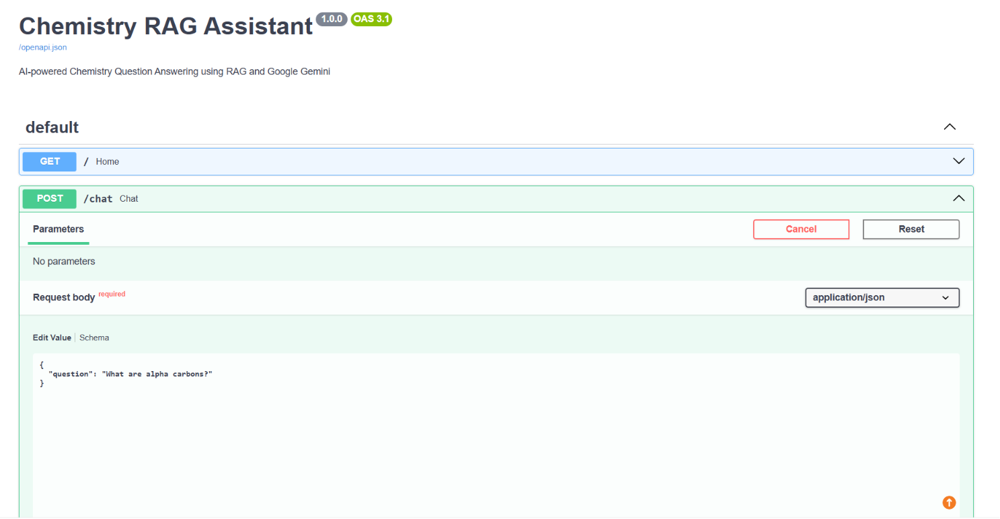
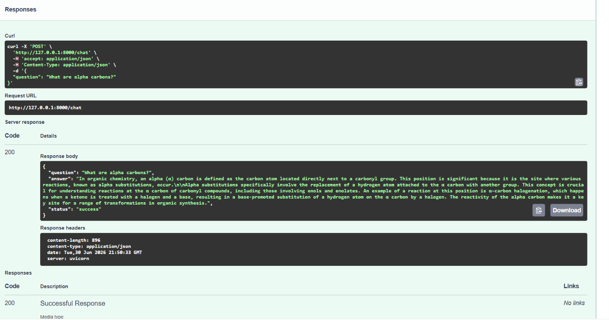

#  Chemistry RAG Assistant

An AI-powered Chemistry Question Answering system built using **Retrieval-Augmented Generation (RAG)**, **FastAPI**, **FAISS**, **Hugging Face Embeddings**, and **Google Gemini**.

The application retrieves relevant information from chemistry notes using semantic search and generates accurate, context-aware answers with Gemini.

---

##  Features

-  Load chemistry notes from PDF
-  Split documents into searchable chunks
-  Generate embeddings using Hugging Face
-  Semantic search with FAISS
-  Answer chemistry questions using Google Gemini
-  FastAPI REST API
-  Interactive Swagger documentation

---

## Technologies Used

- Python 3
- FastAPI
- LangChain
- Hugging Face Embeddings
- FAISS Vector Database
- Google Gemini API
- PyPDF
- Uvicorn

---

## Project Structure

```bash
chem-rag-assistant/
│
├── app/
│   ├── ingest.py
│   ├── llm.py
│   ├── main.py
│   ├── rag.py
│   ├── search.py
│   └── test_rag.py
│
├── data/
│   └── chemistry_notes.pdf
│
├── vectorstore/
│   ├── index.faiss
│   └── index.pkl
│
├── screenshots/
│   ├── swagger.png
│   └── response.png
│
├── .env
├── .gitignore
├── requirements.txt
└── README.md
```

---

## Installation

Clone the repository

```bash
git clone https://github.com/Yonela-Rena/chem-rag-assistant.git
```

Go into the project folder

```bash
cd chem-rag-assistant
```

Create a virtual environment

```bash
python -m venv venv
```

Activate the virtual environment (Windows)

```bash
venv\Scripts\activate
```

Install dependencies

```bash
pip install -r requirements.txt
```

---

## Environment Variables

Create a `.env` file in the project root.

```env
GOOGLE_API_KEY=your_google_gemini_api_key
```

---

## Build the Vector Database

Run the ingestion script once.

```bash
python app/ingest.py
```

This loads the chemistry PDF, splits it into chunks, generates embeddings, and creates the FAISS vector database.

---

## ▶️ Run the API

```bash
uvicorn app.main:app --reload
```

Open Swagger Documentation

```
http://127.0.0.1:8000/docs
```

---

## Example Request

POST `/chat`

```json
{
  "question": "What are alpha carbons?"
}
```

Example Response

```json
{
  "question": "What are alpha carbons?",
  "answer": "Alpha (α) carbons are the carbon atoms located directly next to a carbonyl group...",
  "status": "success"
}
```

---

## Screenshots

### Swagger API



### Example Response



---

## Future Improvements

- Support multiple chemistry textbooks
- Upload PDFs through the API
- Chat history and memory
- Docker support
- Cloud deployment
- Citation of source pages
- Streamlit web interface

---

##  Author

**Yonela Mhloluvele**

Final-year BSc Chemistry & Computer Science Student

Aspiring AI Engineer | Machine Learning | RAG | FastAPI | Scientific AI